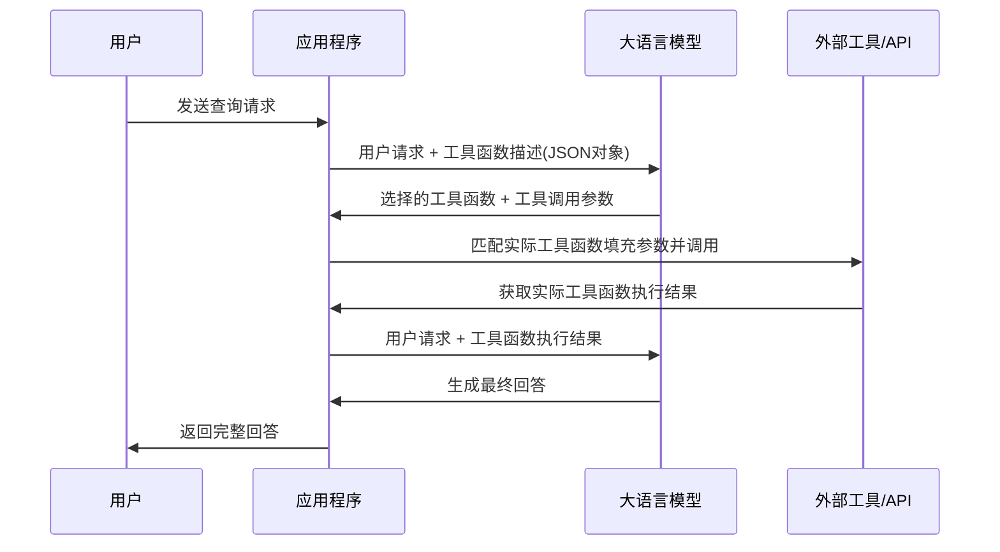

# 大模型工具调用完整指南：从原理到实践

## 目录

1. [引言](#引言)
2. [大模型工具调用基础原理](#大模型工具调用基础原理)
3. [工具调用流程详解](#工具调用流程详解)
4. [Rust 实现案例分析](#rust-实现案例分析)
5. [代码架构设计](#代码架构设计)
6. [最佳实践与优化](#最佳实践与优化)
7. [总结](#总结)

## 引言

随着大语言模型（LLM）技术的快速发展，单纯的文本生成已经无法满足复杂应用场景的需求。**工具调用（Tool Calling）**作为一种重要的扩展机制，让大模型能够与外部系统交互，获取实时数据，执行特定任务，从而构建更加智能和实用的 AI 应用。

本文将深入探讨大模型工具调用的核心原理，并通过一个完整的 Rust 项目案例，详细讲解如何实现一个支持天气查询和网络搜索的智能助手，使用原生的HTTP调用方式，不使用任何第三方LLM服务的客户端，比如Python的openai库，这样便于对原理有更清晰的理解，也便于根据任何编程语言开发自己工具，而不局限于特定库。

大模型工具调用算是LLM中一种动态获取，或说实时获取与用户提问相关数据的一种方式，为用户的问题提供可靠的上下文。另外一种方式基于RAG的方式，这种是基于知识库，更像是一种静态知识。之后会用别的文章再来讨论，敬请期待。

### 关键词

- 大语言模型 (Large Language Model, LLM)
- 工具调用 (Tool Calling)
- Function Calling
- AI Agent
- Rust 异步编程
- DeepSeek API

## 大模型工具调用基础原理

### 什么是工具调用？

**LLM 工具调用**是指大语言模型在生成回答时，能够识别用户需求并主动调用预定义的外部函数或 API 来获取信息或执行操作的能力。这种机制让 LLM 从纯文本生成器转变为能够与现实世界交互的智能代理。

### 核心优势

1. **实时性**：获取最新的数据和信息
2. **准确性**：避免模型幻觉，提供可靠的事实信息
3. **扩展性**：通过工具扩展模型能力边界
4. **可控性**：明确的函数调用过程，便于调试和监控

## 工具调用流程详解

### 完整流程图




### 详细步骤分析

#### 1. 初始请求阶段

用户向系统发送查询请求，应用程序将请求连同预定义的**函数工具描述**一起发送给大模型。

```json
{
  "model": "deepseek-chat",
  "messages": [
    {
      "role": "system",
      "content": "你是一个专业的助手，可以提供天气信息和搜索功能"
    },
    {
      "role": "user", 
      "content": "今天上海的天气怎么样？"
    }
  ],
  "tools": [
    {
      "type": "function",
      "function": {
        "name": "get_weather",
        "description": "获取指定城市的天气预报信息",
        "parameters": {
          "type": "object",
          "properties": {
            "location": {
              "type": "string",
              "description": "城市名称"
            }
          },
          "required": ["location"]
        }
      }
    }
  ],
  "tool_choice": "auto"
}
```

#### 2. 模型决策阶段

大模型分析用户请求，**识别**(根据工具的描述文档，然后自行决定调用需要调用哪些工具)出需要调用天气查询工具，并返回**结构化的工具调用指令**(函数名 + 与之匹配的参数)：

```json
{
  "choices": [
    {
      "message": {
        "role": "assistant",
        "content": null,
        "tool_calls": [
          {
            "id": "call_123",
            "type": "function",
            "function": {
              "name": "get_weather",
              "arguments": "{\"location\": \"上海\"}"
            }
          }
        ]
      }
    }
  ]
}
```

#### 3. 工具执行阶段

应用程序解析工具调用指令，执行实际的 API 调用：

```rust
// 解析工具调用参数
let args: Value = serde_json::from_str(
    call["function"]["arguments"].as_str().unwrap()
)?;
let location = args["location"].as_str().unwrap();

// 调用实际的天气 API
let weather_info = amap::get_weather(location, &amap_key).await?;
```

#### 4. 结果整合阶段

将工具执行结果反馈给大模型，生成最终的用户友好回答：

```json
{
  "model": "deepseek-chat",
  "messages": [
    {
      "role": "system",
      "content": "你是一个专业的天气顾问，请根据天气数据给出详细建议"
    },
    {
      "role": "assistant",
      "content": null,
      "tool_calls": [...]
    },
    {
      "role": "tool",
      "content": "天气数据JSON",
      "tool_call_id": "call_123"
    }
  ]
}
```

## Rust 实现案例分析

### 项目架构概览

我们的项目采用模块化设计，主要包含以下组件：

   ```shell
   src/
   ├── main.rs          # 主程序入口和聊天逻辑
   ├── tools/           # 工具模块
   │   ├── mod.rs      # 工具注册和统一接口
   │   ├── amap.rs     # 高德天气 API 工具
   │   └── serper.rs   # Google 搜索 API 工具
  ```

### 核心代码实现

#### 1. 主聊天逻辑

```rust
async fn chat(user_query: &str) -> Result<(), Box<dyn std::error::Error>> {
    let api_key = env::var("DEEPSEEK_API_KEY").unwrap();
    let endpoint = env::var("DEEPSEEK_API_URL").unwrap();

    // 构建包含工具定义的请求
    let body = json!({
        "model": env::var("MODEL_NAME").unwrap(),
        "messages": [
            {
                "role": "system",
                "content": "你是一个专业的助手，可以提供天气信息和搜索功能"
            },
            {"role": "user", "content": user_query}
        ],
        "tools": get_tools_definition(),
        "tool_choice": "auto", // 使用`auto`让大模型自行决定使用哪些工具
    });

    // 发送初始请求
    let response = reqwest::Client::new()
        .post(&endpoint)
        .header("Authorization", format!("Bearer {}", api_key))
        .json(&body)
        .send()
        .await?
        .json::<Value>()
        .await?;

    // 处理工具调用
    if let Some(tool_calls) = response["choices"][0]["message"]["tool_calls"].as_array() {
        for call in tool_calls {
            let tool_result = handle_tool_call(call).await?;
            
            // 将结果反馈给模型生成最终回答
            let final_response = generate_final_response(&api_key, &endpoint, call, &tool_result).await?;
            
            info!("最终回答: {}", final_response["choices"][0]["message"]["content"]);
        }
    }

    Ok(())
}
```

#### 2. 工具注册系统

为了实现高内聚、低耦合的设计，我们创建了一个统一的工具注册系统：

```rust
// 工具处理结果结构
pub struct ToolResult {
    pub content: String,
    pub system_prompt: String,
}

// 工具处理函数类型
type ToolHandler = Box<dyn Fn(&Value) -> Pin<Box<dyn Future<Output = Result<ToolResult, Box<dyn std::error::Error>>> + Send + Sync>> + Send + Sync>;

// 工具注册表
struct ToolRegistry {
    tools: HashMap<String, ToolHandler>,
}

impl ToolRegistry {
    fn new() -> Self {
        let mut tools = HashMap::new();
        
        // 注册天气查询工具
        let weather_handler: ToolHandler = Box::new(|call: &Value| {
            let call = call.clone();
            Box::pin(async move {
                let args: Value = serde_json::from_str(call["function"]["arguments"].as_str().unwrap())?;
                let location = args["location"].as_str().unwrap();
                
                let amap_key = env::var("AMAP_API_KEY").unwrap();
                let weather_info = amap::get_weather(location, &amap_key).await?;
                
                Ok(ToolResult {
                    content: serde_json::to_string(&weather_info)?,
                    system_prompt: "你是一个专业的天气顾问，请根据获取到的天气数据给出详细的穿衣建议".to_string(),
                })
            })
        });
        tools.insert("get_weather".to_string(), weather_handler);
        
        // 注册搜索工具
        let search_handler: ToolHandler = Box::new(|call: &Value| {
            let call = call.clone();
            Box::pin(async move {
                let args: Value = serde_json::from_str(call["function"]["arguments"].as_str().unwrap())?;
                let query = args["query"].as_str().unwrap();
                
                let search_results = serper::search(query).await?;
                let formatted_results = serper::format_results(&search_results, 3);
                
                Ok(ToolResult {
                    content: formatted_results,
                    system_prompt: "你是一个专业的信息分析师，请根据搜索结果给出准确、简洁的回答".to_string(),
                })
            })
        });
        tools.insert("search".to_string(), search_handler);
        
        Self { tools }
    }
}

// 统一的工具调用处理函数
pub async fn handle_tool_call(call: &Value) -> Result<ToolResult, Box<dyn std::error::Error>> {
    let tool_name = call["function"]["name"].as_str().ok_or("无效的工具名称")?;
    let registry = get_registry();
    
    match registry.get_handler(tool_name) {
        Some(handler) => handler(call).await,
        None => Err(format!("未知的工具调用: {}", tool_name).into()),
    }
}
```

#### 3. 天气查询工具实现

```rust
pub async fn get_weather(location: &str, api_key: &str) -> Result<WeatherResponse, reqwest::Error> {
    // 第一步：获取城市行政编码
    let district_url = format!(
        "https://restapi.amap.com/v3/config/district?key={}&keywords={}&subdistrict=0&extensions=all",
        api_key, location
    );
    
    let district_resp: DistrictResponse = reqwest::get(&district_url).await?.json().await?;
    
    if district_resp.status != "1" || district_resp.districts.is_empty() {
        return Err(reqwest::get("http://error").await.unwrap_err());
    }
    
    let adcode = &district_resp.districts[0].adcode;
    
    // 第二步：获取天气数据
    let weather_url = format!(
        "https://restapi.amap.com/v3/weather/weatherInfo?key={}&city={}&extensions=all&output=json",
        api_key, adcode
    );
    
    let weather_resp: WeatherResponse = reqwest::get(&weather_url).await?.json().await?;
    
    if weather_resp.status != "1" {
        return Err(reqwest::get("http://error").await.unwrap_err());
    }
    
    Ok(weather_resp)
}
```

#### 4. 搜索工具实现

```rust
pub async fn search(query: &str) -> Result<Vec<SearchResult>, reqwest::Error> {
    let api_key = env::var("SERPER_API_KEY").expect("SERPER_API_KEY must be set");
    let client = reqwest::Client::new();

    let response = client
        .post("https://google.serper.dev/search")
        .header("X-API-KEY", api_key)
        .header("Content-Type", "application/json")
        .json(&serde_json::json!({
            "q": query,
            "type": "search"
        }))
        .send()
        .await?
        .json::<SearchResponse>()
        .await?;

    let results = response
        .organic
        .into_iter()
        .map(|result| SearchResult {
            title: result.title,
            link: result.link,
            snippet: result.snippet,
        })
        .collect();

    Ok(results)
}

pub fn format_results(results: &[SearchResult], max_results: usize) -> String {
    let results = results
        .iter()
        .take(max_results)
        .enumerate()
        .map(|(i, result)| {
            format!(
                "{}. {}\n   链接: {}\n   摘要: {}\n",
                i + 1,
                result.title,
                result.link,
                result.snippet
            )
        })
        .collect::<Vec<_>>()
        .join("\n");

    if results.is_empty() {
        "没有找到相关结果。".to_string()
    } else {
        results
    }
}
```

## 代码架构设计

### 设计原则

我们的实现遵循以下软件设计原则：

1. **高内聚**：相关功能集中在同一模块中
2. **低耦合**：模块间依赖关系最小化
3. **模块化**：清晰的模块边界和职责分离
4. **可扩展性**：易于添加新的工具和功能

### 模块职责划分

- **main.rs**：负责主程序逻辑和 LLM 交互
- **tools/mod.rs**：工具注册表和统一接口
- **tools/amap.rs**：天气查询功能实现
- **tools/serper.rs**：搜索功能实现

### 异步编程模式

项目大量使用 Rust 的异步编程特性：

```rust
// 使用 tokio 运行时
#[tokio::main]
async fn main() -> Result<(), Box<dyn std::error::Error>> {
    // 异步函数调用
    chat(user_query).await?;
    Ok(())
}

// 异步工具处理函数
type ToolHandler = Box<dyn Fn(&Value) -> Pin<Box<dyn Future<Output = Result<ToolResult, Box<dyn std::error::Error>>> + Send + Sync>> + Send + Sync>;
```

## 最佳实践与优化

### 1. 错误处理

使用 Rust 的 `Result` 类型进行优雅的错误处理：

```rust
pub async fn handle_tool_call(call: &Value) -> Result<ToolResult, Box<dyn std::error::Error>> {
    let tool_name = call["function"]["name"].as_str().ok_or("无效的工具名称")?;
    // ... 其他逻辑
}
```

### 2. 环境变量管理

使用 `dotenv` 管理敏感配置：

```rust
use dotenv::dotenv;

#[tokio::main]
async fn main() -> Result<(), Box<dyn std::error::Error>> {
    dotenv().ok();
    let api_key = env::var("DEEPSEEK_API_KEY").unwrap();
    // ...
}
```

### 3. 日志记录

使用 `tracing` 进行结构化日志记录：

```rust
use tracing::{Level, info};

info!("用户查询: {}", user_query);
info!("工具调用参数: {}", serde_json::to_string_pretty(&args).unwrap());
```

### 4. 性能优化

- 使用连接池复用 HTTP 连接
- 实现请求缓存机制
- 并发处理多个工具调用

### 5. 安全考虑

- API 密钥安全存储
- 输入参数验证
- 请求频率限制

## 扩展功能建议

### 1. 添加更多工具

```rust
// 数据库查询工具
let db_handler: ToolHandler = Box::new(|call: &Value| {
    // 数据库查询逻辑
});

// 文件操作工具
let file_handler: ToolHandler = Box::new(|call: &Value| {
    // 文件操作逻辑
});
```

### 2. 实现工具链

支持多个工具的串联调用，实现复杂的业务流程。

### 3. 添加缓存机制

```rust
use std::collections::HashMap;
use std::sync::Arc;
use tokio::sync::Mutex;

struct CacheManager {
    cache: Arc<Mutex<HashMap<String, String>>>,
}
```

### 4. 监控和指标

添加工具调用的性能监控和成功率统计。

## 总结

大模型工具调用是构建智能 AI 应用的关键技术。通过本文的详细分析，我们了解了：

1. **工具调用的基本原理**：从用户请求到最终回答的完整流程
2. **实现架构设计**：模块化、可扩展的代码组织方式
3. **具体代码实现**：使用 Rust 构建高性能的工具调用系统
4. **最佳实践**：错误处理、日志记录、性能优化等方面的建议

这种架构不仅提供了良好的代码组织结构，还为后续功能扩展奠定了坚实基础。随着大模型技术的不断发展，工具调用将成为构建复杂 AI 应用的标准模式。

### 相关资源

- [项目源码](https://github.com/yuxuetr/deepseek-agent)
- [DeepSeek API 文档](https://platform.deepseek.com/api-docs/)
- [Rust 异步编程指南](https://rust-lang.github.io/async-book/)
- [Tokio 官方文档](https://tokio.rs/)

---

*本文展示了如何使用 Rust 构建支持工具调用的大模型应用。如果您对实现细节有疑问，欢迎查看完整的项目源码或提出 Issue 讨论。* 
